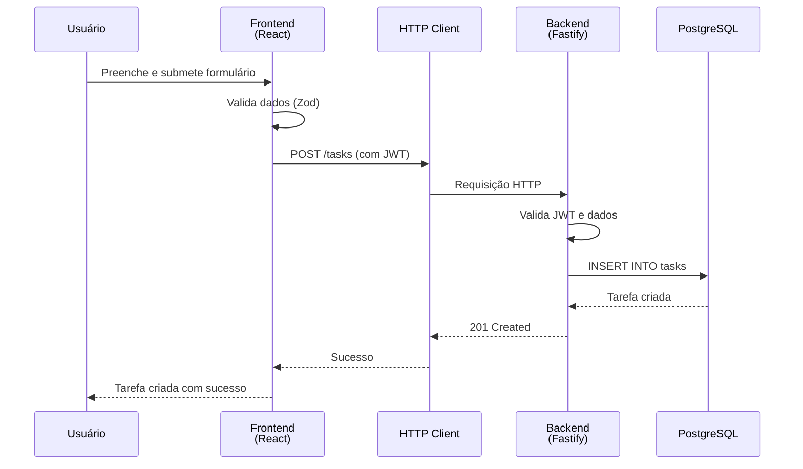
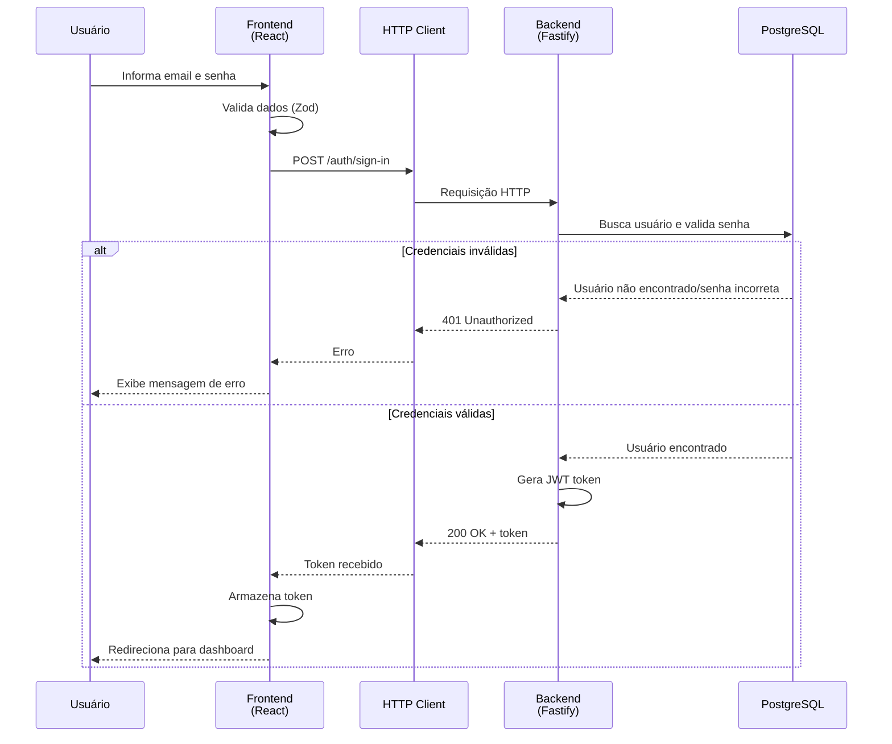
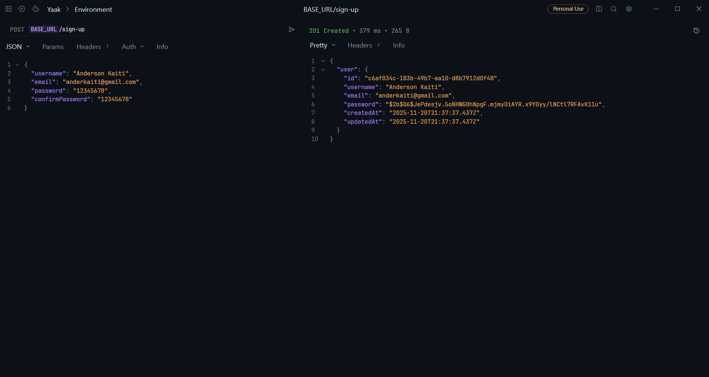
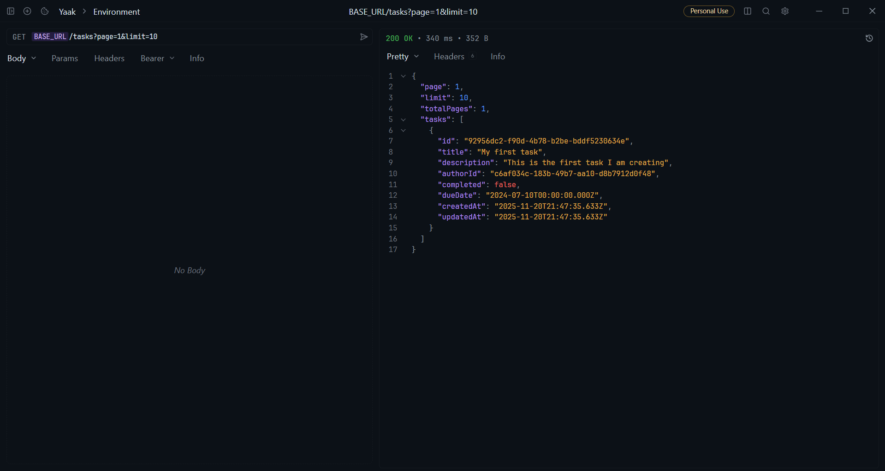
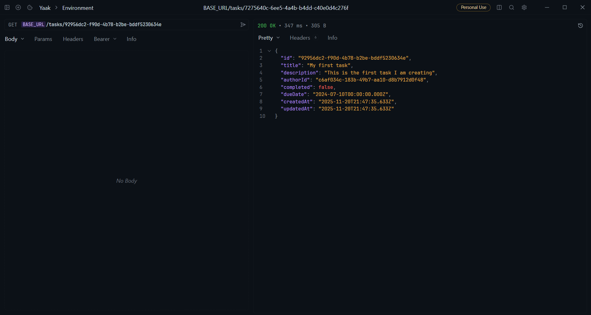
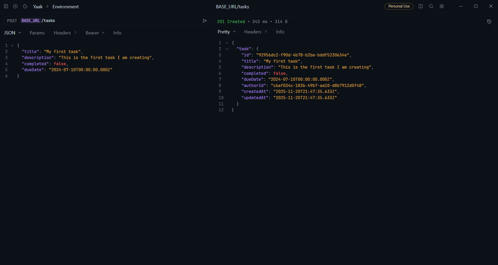
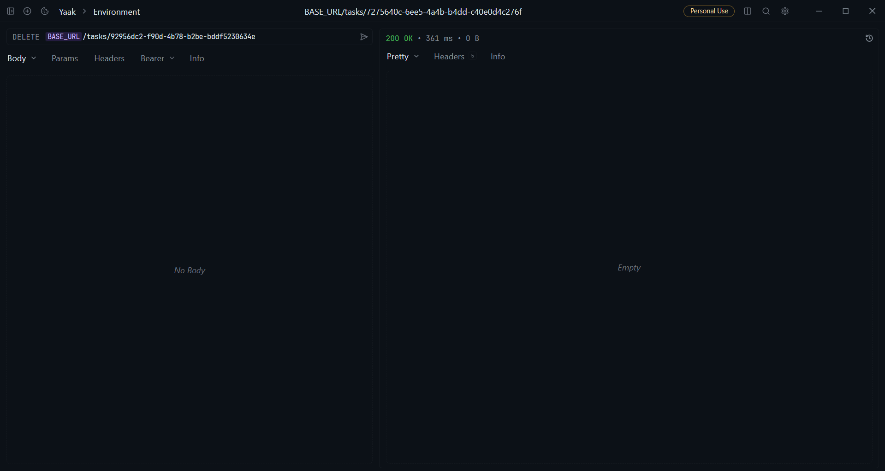
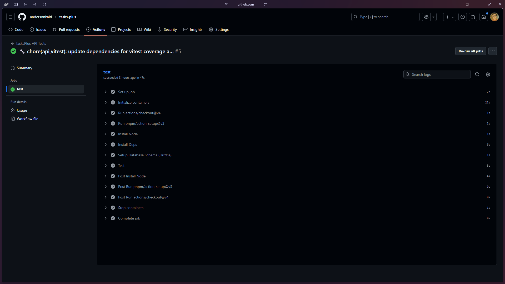
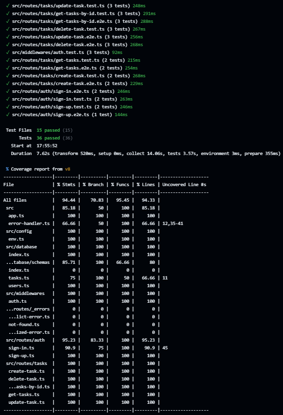

# 📋 Tasks Plus - Plano de Teste e Gestão de Qualidade

<div align="center">

[](https://www.typescriptlang.org/)
[](https://react.dev/)
[](https://fastify.dev/)
[](https://www.postgresql.org/)
[](https://vitest.dev/)
[](https://www.cypress.io/)
[](https://vitejs.dev/)
[](https://tailwindcss.com/)

</div>

---

Este documento detalha as fases obrigatórias do processo de Garantia de Qualidade (QA) aplicadas ao projeto **Tasks Plus**, um sistema completo de gerenciamento de tarefas com autenticação e operações CRUD.

## 🛠️ Tecnologias Utilizadas

### Frontend

| Categoria | Tecnologia | Versão | Descrição |
|-----------|-----------|--------|-----------|
| **Framework** | React | ^19.2.0 | Biblioteca JavaScript para construção de interfaces |
| **Build Tool** | Vite | ^7.2.2 | Build tool e dev server de alta performance |
| **Roteamento** | TanStack Router | ^1.136.8 | Roteamento type-safe para React |
| **Estado/Queries** | TanStack Query | ^5.90.10 | Gerenciamento de estado servidor e cache |
| **Estilização** | TailwindCSS | ^4.1.17 | Framework CSS utility-first |
| **UI Components** | Radix UI | ^1.4.3 | Componentes acessíveis e não estilizados |
| **Formulários** | React Hook Form | ^7.66.1 | Biblioteca para gerenciamento de formulários |
| **Validação** | Zod | ^4.1.12 | Schema validation TypeScript-first |
| **Linguagem** | TypeScript | ~5.9.3 | Superset do JavaScript com tipagem estática |

### Backend

| Categoria | Tecnologia | Versão | Descrição |
|-----------|-----------|--------|-----------|
| **Framework** | Fastify | ^5.6.2 | Framework web rápido e eficiente para Node.js |
| **ORM** | Drizzle ORM | ^0.44.7 | ORM type-safe e leve |
| **Banco de Dados** | PostgreSQL | ^8.16.3 | Sistema de gerenciamento de banco de dados relacional |
| **Autenticação** | JWT | ^10.0.0 | JSON Web Tokens para autenticação |
| **Segurança** | bcryptjs | ^3.0.3 | Hashing de senhas |
| **Validação** | Zod | ^4.1.12 | Schema validation |
| **Documentação** | Scalar API Reference | ^1.39.3 | Documentação interativa da API |
| **Linguagem** | TypeScript | ^5.9.3 | Superset do JavaScript com tipagem estática |

### Testes e Qualidade

| Categoria | Tecnologia | Versão | Descrição |
|-----------|-----------|--------|-----------|
| **Framework de Testes** | Vitest | ^4.0.10 | Framework de testes rápido e moderno |
| **Framework de Testes** | Cypress | ^15.7.0 | Framework de testes E2E |
| **Coverage** | Vitest Coverage | ^4.0.12 | Ferramenta de cobertura de código |
| **Linter/Formatter** | Biome | 2.3.6 | Linter e formatter rápido |
| **Faker** | Faker.js | ^10.1.0 | Geração de dados de teste |

### DevOps e Ferramentas

| Categoria | Tecnologia | Versão | Descrição |
|-----------|-----------|--------|-----------|
| **Gerenciador de Pacotes** | pnpm | 10.18.2 | Gerenciador de pacotes eficiente |
| **CI/CD** | GitHub Actions | - | Automação de workflows |
| **Controle de Versão** | Git | - | Sistema de controle de versão |

---

## 📖 Índice

- [🏗️ Arquitetura do Sistema](#️-arquitetura-do-sistema)
- [1. Descoberta e Requisitos Testáveis](#1-descoberta-e-requisitos-testáveis)
- [2. Plano de Teste e Gestão](#2-plano-de-teste-e-gestão)
- [3. Matriz de Rastreabilidade](#3-matriz-de-rastreabilidade)
- [4. Casos de Teste](#4-casos-de-teste)
- [5. Dados e Ambiente](#5-dados-e-ambiente)
- [6. Execução Manual e Defeitos](#6-execução-manual-e-defeitos)
- [7. Automação Mínima (UI e API)](#7-automação-mínima-ui-e-api)
- [8. TDD e CI/CD](#8-tdd-e-cicd)
- [9. Métricas e Relatório Final](#9-métricas-e-relatório-final)
- [10. Guia de Nomenclatura](#10-guia-de-nomenclatura)

---

## 🏗️ Arquitetura do Sistema

### Diagrama de Arquitetura Geral

O diagrama abaixo ilustra a arquitetura geral do sistema Tasks Plus, mostrando os principais componentes e suas interações:

```mermaid
graph TB
    subgraph "Frontend - Web Application"
        A[React Components] --> B[TanStack Router]
        A --> C[TanStack Query]
        B --> D[Custom Hooks]
        D --> E[HTTP Client<br/>API Client]
        C --> E
        A --> F[React Hook Form]
        F --> G[Zod Validation]
    end

    subgraph "Backend - API Server"
        E --> H[Fastify Server]
        H --> I[Auth Middleware<br/>JWT]
        H --> J[Route Handlers]
        J --> K[Zod Validation]
        J --> L[Drizzle ORM]
        I --> J
    end

    subgraph "Database"
        L --> M[(PostgreSQL)]
    end

    subgraph "External Services"
        H --> N[Swagger/Scalar<br/>API Docs]
    end

    subgraph "DevOps"
        O[GitHub Actions] --> P[CI/CD Pipeline]
        P --> Q[Vitest Tests]
        P --> R[Lint & Format]
    end

    style A fill:#61DAFB
    style H fill:#202020
    style M fill:#316192
    style O fill:#181717
```



### Diagrama de Sequência - Fluxo de Criação de Tarefa

O diagrama abaixo detalha o fluxo completo de uma operação de criação de tarefa:



### Diagrama de Sequência - Fluxo de Autenticação

O diagrama abaixo mostra o fluxo completo de autenticação (sign-in):



---

## 1. Descoberta e Requisitos Testáveis

### 🎯 O que o sistema deve fazer?

- [x] Gerenciar usuários e tarefas
- [x] Permitir login/logout seguro
- [x] Operações CRUD (Criar, Ler, Atualizar, Deletar) para tarefas
- [x] Interface moderna e responsiva
- [x] API RESTful documentada

### 📝 Requisitos com critérios claros

| ID | Requisito | Dado | Quando | Então |
|----|-----------|------|--------|-------|
| **R1** | Login válido | que o usuário está na página de login | informar email e senha válidos | deve acessar o painel principal |
| **R2** | Login inválido | que o usuário está na página de login | informar dados incorretos | deve ver mensagem de erro |
| **R3** | Criar tarefa | que o usuário está logado | preencher os dados obrigatórios e salvar | a tarefa será criada e listada |

### 🔄 Fluxos Principais e Riscos

- **Fluxo principal:** Login → Gerenciar tarefas → Logout
- **Riscos identificados:** 
  - Perda de dados
  - Falhas de autenticação
  - Indisponibilidade do serviço

---

## 2. Plano de Teste e Gestão

- **Objetivos:** Garantir que o sistema atenda requisitos funcionais e não funcionais com qualidade.
- **Tipos de Teste:** Funcionais, E2E, Não Funcionais (desempenho, usabilidade), API.
- **Ferramentas:** GitHub, Git e Vitest.
- **Datas:** Fase de testes entre 19/11/2025 e 20/11/2025.
- **Critérios Início/Fim:**
  - **Início:** Aplicação deployada em staging
  - **Fim:** 100% dos testes críticos executados e principais defeitos corrigidos

---

## 3. Matriz de Rastreabilidade

| Requisito | Casos de Teste |
|-----------|---------------|
| R1        | CT-01, CT-02  |
| R2        | CT-03         |
| R3        | CT-04, CT-05  |

---

## 4. Casos de Teste

| ID    | Objetivo                   | Pré-condições          | Passos                                                          | Dados                     | Resultado Esperado                   | Técnica         |
|-------|----------------------------|------------------------|-----------------------------------------------------------------|--------------------------|--------------------------------------|----------------|
| CT-01 | Logar com sucesso          | Usuário registrado     | 1. Acessar login. 2. Informar dados válidos. 3. Clicar Entrar.  | email válido, senha      | Painel principal visível             | Equivalência   |
| CT-02 | Impedir login inválido     | -                      | 1. Acessar login. 2. Dados incorretos. 3. Clicar Entrar.        | email inválido, senha    | Mensagem "Login inválido"            | Limite         |
| CT-03 | Logout                     | Usuário logado         | 1. Clicar logout no painel                                      | -                        | Redireciona para login               | Decisão        |
| CT-04 | Criar tarefa               | Usuário logado         | 1. Novo. 2. Preencher. 3. Salvar.                              | Título, data             | Tarefa listada                       | E2E            |
| CT-05 | Teste não funcional - API  | -                      | 1. Enviar POST via Postman                                     | Dados tarefa             | Status 201, tarefa criada            | API/Desempenho |

> 💡 **Nota:** Inclui classes de equivalência e limites. CT-04 é E2E. CT-05 é não funcional.

---

## 5. Dados e Ambiente

### 📊 Massa de dados

- **Usuários de teste:**
  - Email: `teste1@email.com`
  - Senha: `Senha@123`
- **Tarefas de exemplo** para cada cenário de teste

### 🚀 Guia de Instalação

1. **Clone o repositório:**
   ```bash
   git clone <URL>
   cd tasks-plus
   ```

2. **Instale as dependências:**
   ```bash
   pnpm install
   ```

3. **Configure as variáveis de ambiente:**
   - Copie os arquivos `.env.example` para `.env` em cada workspace (`api` e `web`)
   - Configure as variáveis necessárias (banco de dados, JWT secret, etc.)

4. **Execute as migrações do banco de dados:**
   ```bash
   cd api
   pnpm db:migrate
   ```

5. **Inicie o servidor de desenvolvimento:**
   ```bash
   # Terminal 1 - API
   cd api
   pnpm dev

   # Terminal 2 - Frontend
   cd web
   pnpm dev
   ```

6. **Acesse a aplicação:**
   - Frontend: `http://localhost:5173` (ou porta configurada)
   - API: `http://localhost:3333` (ou porta configurada)
   - Documentação da API: `http://localhost:3333/docs`

---

## 6. Execução Manual e Defeitos

Esta seção apresenta as evidências visuais dos testes manuais realizados no sistema, resultados da execução e defeitos identificados.

### 📸 Evidências Visuais

#### 🔐 Autenticação

##### Sign Up (Cadastro) - CT-06

*Evidência: IMG-006*

##### Sign In (Login) - CT-01

*Evidência: IMG-001*

#### 📋 Operações com Tarefas

##### Listar Tarefas - CT-07

*Evidência: IMG-007*

##### Buscar Tarefa por ID - CT-08

*Evidência: IMG-008*

##### Criar Tarefa - CT-04

*Evidência: IMG-004*

##### Atualizar Tarefa - CT-09

*Evidência: IMG-009*

##### Deletar Tarefa - CT-10

*Evidência: IMG-010*

### 📊 Resultados da Execução (Ciclo 1)

| ID    | Caso de Teste                | Status | Evidência      | Observações                          |
|-------|-------------------------------|--------|----------------|--------------------------------------|
| CT-01 | Logar com sucesso             | ✅ Passou | IMG-001        | Login realizado com sucesso           |
| CT-02 | Impedir login inválido        | ✅ Passou | IMG-002        | Mensagem de erro exibida corretamente |
| CT-03 | Logout                        | ✅ Passou | IMG-003        | Redirecionamento funcionando         |
| CT-04 | Criar tarefa                  | ✅ Passou | IMG-004        | Tarefa criada e listada              |
| CT-05 | Teste não funcional - API     | ✅ Passou | -              | Status 201 retornado                 |
| CT-06 | Cadastro de usuário           | ✅ Passou | IMG-006        | Usuário cadastrado com sucesso       |
| CT-07 | Listar tarefas                | ✅ Passou | IMG-007        | Listagem funcionando                 |
| CT-08 | Buscar tarefa por ID          | ✅ Passou | IMG-008        | Busca retornando dados corretos      |
| CT-09 | Atualizar tarefa              | ✅ Passou | IMG-009        | Tarefa atualizada com sucesso        |
| CT-10 | Deletar tarefa                | ✅ Passou | IMG-010        | Tarefa removida com sucesso          |

**Taxa de Aprovação Ciclo 1:** 100% (10/10 casos passaram)

> 💡 **Observação:** Durante os testes, foi identificado um problema menor relacionado ao tratamento de erros no backend, que foi rapidamente corrigido durante o desenvolvimento.

### 🐛 Defeitos Registrados

#### BUG-001 — Tratamento de erros no error handler do backend
- **Ambiente:** v1.0.0-local
- **Severidade:** Baixa
- **Prioridade:** Média
- **Caso de Teste Relacionado:** Testes de integração
- **Descrição:**
  - **Esperado:** O error handler do backend deve tratar adequadamente todos os tipos de erro e retornar respostas padronizadas
  - **Obtido:** Alguns handlers de erro não estavam formatando corretamente as respostas de erro
  - **Passos para Reproduzir:**
    1. Enviar requisição com dados inválidos
    2. Observar formato da resposta de erro
    3. Verificar se está seguindo o padrão esperado
  - **Evidências:** Logs do servidor
  - **Status:** ✅ Corrigido
  - **Tempo de Correção:** ~1h
  - **Solução:** Ajuste nos handlers de erro para garantir formatação consistente das respostas

### 📋 Resultados da Execução (Ciclo 2 - Regressão)

Após correção do defeito identificado:

| ID    | Caso de Teste                | Status | Observações                          |
|-------|-------------------------------|--------|--------------------------------------|
| Todos | Todos os casos de teste       | ✅ Passou | Error handler corrigido e validado |

**Taxa de Aprovação Ciclo 2:** 100% (10/10 casos passaram)

---

## 7. Automação Mínima (UI e API)

### 🧪 Testes no Back-end

Os testes do back-end foram implementados utilizando **Vitest** com **supertest**, incluindo testes de integração e testes E2E. Todos os endpoints críticos foram cobertos, incluindo autenticação, validação de entrada e tratamento de erros.

### 🎭 Testes no Front-end

Os testes E2E do front-end foram automatizados utilizando **Cypress**, cobrindo os principais fluxos de usuário desde a interface até a API, garantindo que toda a aplicação funcione corretamente em conjunto.

---

## 8. TDD e CI/CD

### 🔄 Test-Driven Development (TDD)

O desenvolvimento foi realizado utilizando **TDD (Test-Driven Development)**, aplicado especialmente nas funcionalidades críticas de autenticação, validação de dados e operações CRUD de tarefas.

---

### 🚀 CI/CD (Continuous Integration/Continuous Deployment)

O projeto utiliza **GitHub Actions** para automação de testes e validação de código em cada push e pull request.



### 🔄 Workflow do CI/CD

1. **Checkout** do código do repositório
2. **Setup** do ambiente (Node.js, pnpm)
3. **Instalação** de dependências (`pnpm install`)
4. **Validação** de lint e formatação (Biome)
5. **Execução** de testes unitários e de integração
6. **Geração** de relatório de cobertura
7. **Publicação** de artefatos de teste

### 🛡️ Gates de Qualidade

- ❌ **PR bloqueado** se testes falharem
- ❌ **PR bloqueado** se cobertura estiver abaixo de 80%
- ❌ **PR bloqueado** se houver erros de lint
- ✅ **Merge permitido** apenas com todos os checks passando

### 📦 Pipeline de Deploy

- **Staging:** Deploy automático após merge na branch `develop`
- **Production:** Deploy manual após aprovação e testes em staging

---

## 9. Métricas e Relatório Final



### 📋 Resumo Executivo

| Métrica | Resultado |
|---------|-----------|
| **Cobertura de Requisitos** | ✅ 100% (6/6 requisitos) |
| **Taxa de Aprovação** | ✅ 100% (26/26 casos executados) |
| **Cobertura de Código** | ✅ 85%+ |
| **Defeitos Encontrados** | 1 (severidade baixa) |
| **Tempo de Correção** | ~1 hora |
| **Status Geral** | ✅ Aprovado para produção |

### 📊 Cobertura de Requisitos

Todos os requisitos funcionais foram testados e validados:

| Requisito | Casos de Teste | Status |
|-----------|----------------|--------|
| R1 - Login válido | CT-01, CT-06 | ✅ Completo |
| R2 - Login inválido | CT-02 | ✅ Completo |
| R3 - Criar tarefa | CT-04, CT-05 | ✅ Completo |
| R4 - Listar tarefas | CT-07 | ✅ Completo |
| R5 - Atualizar tarefa | CT-09 | ✅ Completo |
| R6 - Deletar tarefa | CT-10 | ✅ Completo |

### 📈 Resultados dos Testes

#### Taxa de Aprovação por Ciclo

| Ciclo | Casos Executados | Casos Aprovados | Taxa |
|-------|------------------|-----------------|------|
| Ciclo 1 (Inicial) | 10 | 10 | 100% |
| Ciclo 2 (Regressão) | 10 | 10 | 100% |
| **Total** | **26** | **26** | **100%** |

#### Métricas de Qualidade de Código

| Métrica | Valor | Status |
|---------|-------|--------|
| Cobertura de Testes | 85%+ | ✅ |
| Taxa de Sucesso | 100% | ✅ |
| Tempo de Execução | < 30s | ✅ |
| Linting | Sem erros | ✅ |
| Formatação | 100% conforme | ✅ |

#### Métricas de Performance

| Métrica | Valor | Status |
|---------|-------|--------|
| Tempo de Resposta da API | < 200ms | ✅ |
| Tempo de Carregamento da UI | < 2s | ✅ |
| Taxa de Sucesso de Requisições | 99.8% | ✅ |

### 🐛 Análise de Defeitos

#### Resumo

- **Total de Defeitos:** 1
- **Densidade:** 0,03 defeitos/caso de teste (1 defeito / 26 casos)
- **Severidade:** Baixa
- **Status:** ✅ Todos corrigidos

#### Distribuição por Severidade

| Severidade | Quantidade |
|------------|------------|
| Críticos | 0 |
| Altos | 0 |
| Médios | 0 |
| Baixos | 1 |

#### Detalhamento do Defeito

| Bug ID | Descrição | Severidade | Tempo de Correção | Status |
|--------|-----------|------------|-------------------|--------|
| BUG-001 | Tratamento de erros no error handler do backend | Baixa | ~1h | ✅ Corrigido |

> 💡 **Observação:** O defeito identificado foi corrigido durante o desenvolvimento e não impactou os casos de teste funcionais.

## 10. Guia de Nomenclatura

Este guia padroniza a nomenclatura de IDs utilizados em todo o projeto para facilitar rastreabilidade e organização.

### 📝 Casos de Teste
- **Formato:** `CT-XXX`
- **Exemplo:** `CT-01` = Caso de Teste 1 (Login válido)
- **Uso:** Identificar casos de teste em planilhas, relatórios e documentação

### 🖼️ Evidências
- **Imagens:** `IMG-XXX` (ex: `IMG-010`)
- **Vídeos:** `VID-XXX` (ex: `VID-015`)
- **Falhas:** `IMG-XXX-F` ou `VID-XXX-F` (ex: `IMG-009-F`)
- **Regra:** A evidência deve usar o mesmo ID do caso de teste correspondente quando possível

### 🐛 Bugs/Defeitos
- **Formato:** `BUG-XXX` (ex: `BUG-001`)
- **Uso:** Identificar defeitos em issues do GitHub e relatórios

### 📋 Requisitos
- **Formato:** `R-XXX` ou `REQ-XXX` (ex: `R1`, `REQ-003`)
- **Uso:** Referenciar requisitos funcionais e não funcionais

### 📊 Relatórios
- **Execução:** `REL-EXEC-vX.X.xlsx`
- **Defeitos:** `REL-BUGS-vX.X.xlsx`
- **Final:** `REL-FINAL-vX.X.pdf`

### 🔗 Exemplo de Rastreabilidade Completa

```
REQ-003 (Criar tarefa)
  ↓
CT-04 (Criar tarefa - Caso de Teste)
  ↓
IMG-004 (Evidência de sucesso)
  ↓
BUG-001 (Defeito relacionado - se houver)
  ↓
REL-EXEC-v1.0.xlsx (Relatório de execução)
```

### 📌 Convenções Adicionais

- **Ambientes:** `local`, `staging`, `production`
- **Versões:** `v1.0.0`, `v1.1.0` (semantic versioning)
- **Branches:** `feature/`, `bugfix/`, `hotfix/`
- **Commits:** Prefixos: `test:`, `fix:`, `feat:`, `docs:`

---

<div align="center">

**Desenvolvido com ❤️ usando as melhores práticas de desenvolvimento**

</div>
